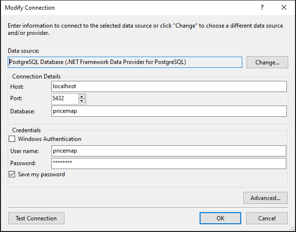

# Dotnet technical test: Listing API

## Installation
> Prerequisites : 
- .Net 6 SDK (https://dotnet.microsoft.com/en-us/download/dotnet/6.0)
- Docker (https://www.docker.com/)

## Development
The project can be improved on different ways. You are totally free to improve the tests, codebase, etc... as you want.
You can explain your improvements and choices on the [SOLUTION.md](../SOLUTION.md) file 

## Using a command line interface
1. Run `cd c#-dotnet`
2. Run `docker compose up` (this will build the listingapi project and the database)
3. For the listingapi swagger go to http://localhost:8686/swagger/index.html 

## Using visual studio
1. Open the solution file `listingapi.sln` found in the folder `c#-dotnet`
2. Set the project docker-compose as the startup project
3. Run the Docker Compose project
4. The listingapi swagger should open automatically or go to https://localhost:8686/swagger/index.html

You should then see your 2 containers running!

## Explore the database
1. After running your docker compose, using your favorite database management tool you will be able to explore the database using the following credentials : 
- POSTGRES_DB: listing
- POSTGRES_USER: listing
- POSTGRES_PASSWORD: listing

Example : 
1. Using visual studio server explorer go to : View > Server Explorer (CTRL+ALT+S)
2. Install the PostgreSQL integration following : https://marketplace.visualstudio.com/items?itemName=RojanskyS.NpgsqlPostgreSQLIntegration 
3. Add a new connection with the following configuration
4. Explore to your heart content

### You are now ready to go, please read carefully the instructions in the README and good luck to you !
